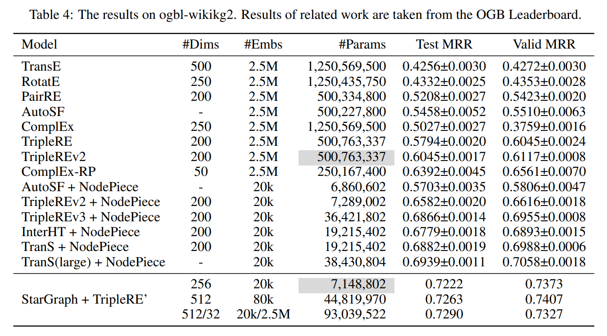
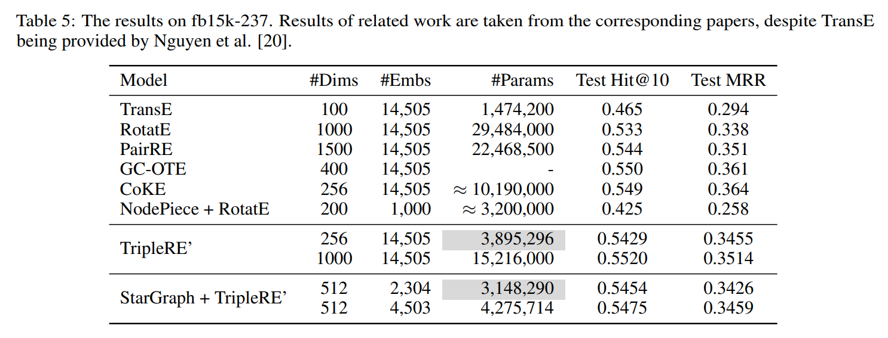

# StarGraph for [OGB WikiKG 2](https://ogb.stanford.edu/docs/linkprop/#ogbl-wikikg2) and [FB15k-237](https://deepai.org/dataset/fb15k-237)
Conventional representation learning algorithms for knowledge graphs (KG) map each entity to a unique embedding vector, ignoring the rich information contained in the neighborhood. We propose a method named StarGraph, which gives a novel way to utilize the neighborhood information for large-scale knowledge graphs to obtain entity representations. An incomplete two-hop neighborhood subgraph for each target node is at first generated, then processed by a modified self-attention network to obtain the entity representation, which is used to replace the entity embedding in conventional methods. We achieved SOTA performance on ogbl-wikikg2 and got competitive results on fb15k-237. The experimental results proves that StarGraph is efficient in parameters, and the improvement made on ogbl-wikikg2 demonstrates its great effectiveness of representation learning on large-scale knowledge graphs.



+ A more comprehensive description of the method can be found at [StarGraph: Knowledge Representation Learning based on Incomplete Two-hop Subgraph](https://arxiv.org/abs/2205.14209)

## Running
1. Install the requirements from the `requirements.txt`
2. Check the datasets. Nothing needs to be done if everything is in position:  
&emsp; a. OGB WikiKG 2 will be automatically downloaded calling ogb.linkproppred.LinkPropPredDataset, which might take a long time (line\#182 in `processors.py`)  
&emsp; b. FB15k-237 has been provided in `./dataset/fb15k-237/`
1. Run the following commands to reproduce the results of **StarGraph + TripleRE'** reported in the paper  

### For Results in Table 4 on OGB WikiKG 2  
```python run.py --print_on_screen --cuda --do_train -b 512 -n 64 -adv --model TripleRE -lr 0.0001 --valid_steps 60000 --log_steps 60000 --max_steps 500000 --do_valid --do_test --test_log_steps 60000 --gamma 6.0 -randomSeed 0 -a 2 --drop 0.05 --uni_weight --inverse --val_inverse -u 0.1 --anchor_size 20000 -ancs 20 -d 256 -path```

```python run.py --print_on_screen --cuda --do_train -b 512 -n 64 -adv --model TripleRE -lr 0.00005 --valid_steps 60000 --log_steps 60000 --max_steps 500000 --do_valid --do_test --test_log_steps 60000 --gamma 6.0 -randomSeed 0 -a 2 --drop 0.05 --uni_weight --inverse --val_inverse -u 0.1 --anchor_size 80000 -ancs 20 -d 512 --head_dim 8 --mlp_ratio 2 -path```

```python run.py --print_on_screen --cuda --do_train -b 512 -n 64 -adv --model TripleRE -lr 0.0002 --valid_steps 60000 --log_steps 60000 --max_steps 500000 --do_valid --do_test --test_log_steps 60000 --gamma 6.0 -randomSeed 0 -a 2 --drop 0.05 --uni_weight --inverse --val_inverse -u 0.1 --anchor_size 20000 -ancs 20 -nbors 5 -center --node_dim 32 -d 512 --head_dim 8 --mlp_ratio 2```

### For Results in Table 5 on FB15k-237  
```python run.py --print_on_screen --cuda --do_train -b 512 -n 64 -adv --dataset fb15k-237 --model TripleRE -lr 0.0005 --valid_steps 20000 --log_steps 20000 --max_steps 100000 --do_valid --do_test --test_log_steps 20000 --gamma 6.0 -randomSeed 0 -a 2 --drop 0.05 --true_negative -u 1 --anchor_size 1 -ancs 20 -d 512 -path --head_dim 8 --mlp_ratio 2 -skip 0.2```

```python run.py --print_on_screen --cuda --do_train -b 512 -n 64 -adv --dataset fb15k-237 --model TripleRE -lr 0.0005 --valid_steps 20000 --log_steps 20000 --max_steps 100000 --do_valid --do_test --test_log_steps 20000 --gamma 6.0 -randomSeed 0 -a 2 --drop 0.05 --true_negative -u 1 --anchor_size 1 -ancs 20 -d 512 -path --head_dim 8 --mlp_ratio 2 -skip 0.5```

## Citation
If you find this work useful, please consider citing the paper:
```
@misc{li2022stargraph,
    title={StarGraph: Knowledge Representation Learning based on Incomplete Two-hop Subgraph},
    author={Hongzhu Li and Xiangrui Gao and Linhui Feng and Yafeng Deng and Yuhui Yin},
    year={2022},
    eprint={2205.14209},
    archivePrefix={arXiv},
    primaryClass={cs.AI}
}
```